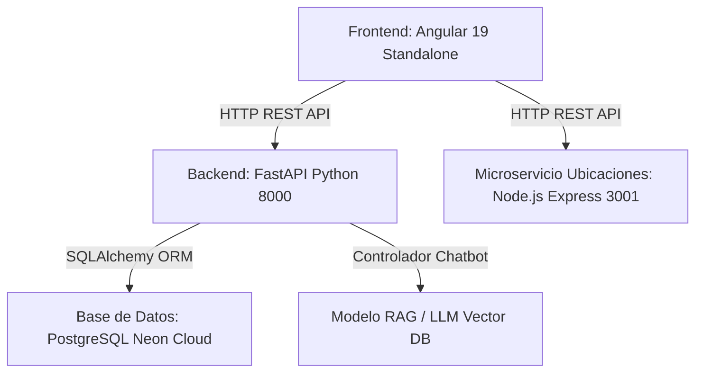

# Documentación Técnica Extensa y Guía de Ingesta para Modelo RAG (VolunSys)

## 1. Visión General del Sistema
**VolunSys** es una plataforma web integral de gestión de voluntariado e impacto social. Conecta a ciudadanos (voluntarios) con coordinadores de proyectos y administradores en tres áreas principales de impacto comunitario:

1. **Limpieza de Playas**: Conservación marina y recolección de residuos (medido en kg).
2. **Rescate Animal**: Atención médica, vacunación y adopción de animales callejeros.
3. **Apoyo a Adultos Mayores**: Acompañamiento emocional y actividades recreativas en asilos.

### Sistema de Control de Acceso Basado en Roles (RBAC)
- **Rol 1 (Admin)**: Acceso total, gestión de usuarios, asignación de permisos, visualización de métricas analíticas en Microsoft PowerBI.
- **Rol 2 (Coordinador / Organizador)**: Planificación de nuevas jornadas y asignación de tareas u operativas específicas a voluntarios inscritos.
- **Rol 3 (Voluntario)**: Registro mediante Formulario Reactivo, inscripción a jornadas, visualización de tareas asignadas y marcado de asistencia.

---

## 2. Arquitectura de Software y Stack Tecnológico

### Tecnologías Clave:
- **Frontend**: Angular 19 Standalone Components, `ReactiveFormsModule`, RxJS, Bootstrap 5.3, Vanilla CSS Glassmorphism.
- **Backend API**: FastAPI (Python 3.11+), Uvicorn, Pydantic, PyJWT (JSON Web Tokens), Bcrypt.
- **Microservicio Ubicaciones**: Node.js + Express (Puerto 3001).
- **Base de Datos**: PostgreSQL Serverless en Neon Cloud.
- **Motor de IA / RAG**: `chat_controller.py` para recuperación contextual e integración con LLMs.

---

## 3. Mapeo Extenso de Archivos y Componentes

### Frontend (`frontend/src/app/`)
- `pages/registro/`: **Formulario Reactivo Principal** (`RegistroComponent`). Implementa `FormBuilder`, `FormGroup`, `Validators` (`required`, `email`, `minLength(8)`, regex para mayúscula/minúscula/número).
- `pages/organizador/asignaciones/`: Interface visual de asignación de tareas con diseño Glassmorphic (cristal translúcido), fondo con imagen y superposición semi-transparente, buscador en tiempo real y tarjetas de métricas.
- `pages/usuarios/`: Gestión RBAC de usuarios por parte de administradores.
- `pages/playas/`, `pages/rescate/`, `pages/adultos/`: Módulos específicos por tipo de programa.
- `pages/powerbi/`: Integración de cuadros de mando analíticos de PowerBI.
- `services/api.service.ts`: Cliente HTTP que centraliza la comunicación con FastAPI y el microservicio de ubicaciones.
- `components/chatbot/`: Componente de interfaz de chat flotante diseñado para consumir las respuestas del modelo RAG.

### Backend Python (`app/`)
- `main.py`: Punto de entrada FastAPI y middlewares CORS.
- `controllers/usuarios_controller.py`: Autenticación, creación de cuentas y JWT.
- `controllers/voluntariados_controller.py`: Lógica de eventos y proyectos.
- `controllers/inscripcion_controller.py`: Gestión de asistencias y tareas asignadas.
- `controllers/chat_controller.py`: Endpoint `/api/chat` destinado al procesamiento y retrieval del Modelo RAG.
- `config/security.py`: Encriptación con Bcrypt y codificación JWT.
- `config/database.py`: URI de conexión a Neon PostgreSQL.

---

## 4. Guía de Integración para el Modelo RAG (Retrieval-Augmented Generation)

### Flujo de Consulta del RAG:
1. **Ingestión**: Este documento (`DOCUMENTACION_RAG_VOLUNSYS.md` y `RESUMEN_PROYECTO_SUSTENTACION.txt`) se convierte en vectores (Embeddings) y se almacena en la base de datos vectorial (ChromaDB, Pinecone, FAISS o LangChain).
2. **Recepción**: La consulta del voluntario ingresa por el componente `app-chatbot` en la interfaz.
3. **Retrieval**: El backend (`/api/chat`) recupera los fragmentos de contexto más relevantes de la base de datos vectorial sobre los programas, tareas, roles o reglas de validación de VolunSys.
4. **Generation**: El modelo LLM genera una respuesta contextualizada precisa evitando alucinaciones.

---

## 5. Preguntas de Sustentación Académica para el Profesor

### Q1: ¿Por qué implementaron un Formulario Reactivo en lugar de uno basado en plantillas?
> "Utilizamos un Formulario Reactivo (`registroForm`) en el registro porque permite manejar la lógica de validación e inmutabilidad en el archivo TypeScript mediante `FormBuilder` y `Validators`. Esto separa la presentación de la lógica de negocio, facilita pruebas unitarias y permite reaccionar a estados en tiempo real como `valid`, `invalid` y `touched`."

### Q2: ¿Cómo funciona la arquitectura de Microservicios en el proyecto?
> "El proyecto desacopla las responsabilidades: Angular maneja la interfaz de usuario en el puerto 4200, FastAPI en Python (puerto 8000) procesa la API REST principal y la persistencia en Neon PostgreSQL Cloud, y un microservicio independiente en Node.js Express (puerto 3001) sirve el catálogo de ubicaciones."

### Q3: ¿Cómo se integra el Modelo RAG con la plataforma?
> "El Modelo RAG procesa la base de conocimiento vectorial de VolunSys para alimentar el bot flotante (`app-chatbot`). Permite responder dudas sobre programas, cupos y tareas específicas según el rol del usuario autenticado."
